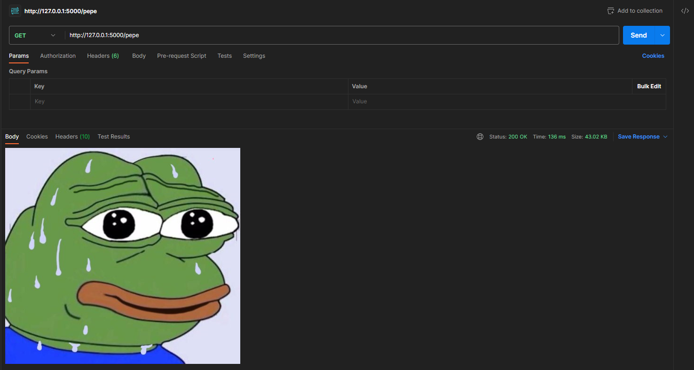
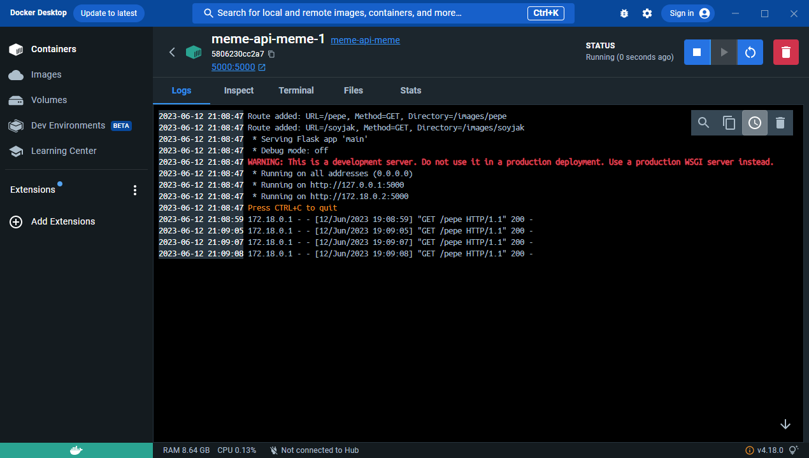

# meme-api 🐸
 Serve random meme (or any image) through Flask API and store it in clipboard, to quickly paste it to your friends.


# Usage

Project is to be used with Docker-compose.

I've created two docker-compose files, each allows different hosting scenario.

- `docker-compose-localhost.yml` for hosting on localhost (With Docker Desktop, for example)
- `docker-compose-traefik.yml` for hosting in homelab scenario. Comes with example, battle-tested Traefik configuration.


`docker-compose-localhost.yml` is enough to run this app on a local computer. Here I am running it via Docker Desktop and accessing endpoint via Postman:





But I am also presenting a more advanced deployment Scenario. `docker-compose-traefik.yml` shows how it is possible to deploy this app with: 
- Traefik reverse proxy
- with DNS 
- with TLS
- enabled API key plugin for Traefik (https://plugins.traefik.io/plugins/644ae964a57ce22514790380/api-key-middleware API Key Middleware)
- Path rewrite so that app can be accesed under `/meme/` instead of root `/`

So that it can be accesed more like a real-life API endpoint:


Together with this API, I also share simple AHK + Powershell script (tested on Windows 10) to easily fetch image from endpoint and copy it to clipboard for easy paste. All this is easily bindable to key combination, thanks to AHK.

Fetching script uses Windows toast notification, so that you can preview, how image you fetched looks like - or know if something went wrong


# How to use

## API

Container reads `config.yaml` to read configuration file. Based on exmaple file:

```yaml
routes:
  - url: /cats
    method: GET
    image_dir: /images/cats
  - url: /dogs
    method: GET
    image_dir: /images/dogs

```

Here you should specify: *endpoint* for particular type of memes along with *image folder path* (as visible from inside container). 
This should correspond with docker-compose volume configuration on host:

```yaml
volumes:
    - ./config.yaml:/config.yaml
    - "/path/to/folder1:/images/cats"
    - "/path/to/folder2:/images/dogs"
```

## Script

If you wish to use script for automatic copy to clipboard, make sure you set up these parameters:


### AHK 

Inside AHK script, configure:

- Powershell script path (needed for all the work, AHK just calls the script and handles bind)
- keyboard bind
- positional argument, this is needed for Powershell script to know which endpoint needs to be called. This allows to use single script for multiple endpoint.


Here is an example from repo. This AHK script
- binds action to Ctrl+Alt+P (`^!p::`)
- defines PS script path - here ir is relative to current directory (scriptPath)
- runs PS script with `cats` positional argument

```ahk
; Define the key bind (Ctrl+Alt+P)
^!p::
    ; Specify the path to the PowerShell script
    scriptPath := ".\fetch_image.ps1"
    
    ; Run the PowerShell script
    ; RunWait, powershell.exe -ExecutionPolicy Bypass -WindowStyle Minimized -File "%scriptPath% cats
    RunWait, powershell.exe -ExecutionPolicy Bypass -Command "%scriptPath% cats"
    
    ; Return to the AHK script
    return

```


### Powershell script

Powershell does all the heavy job - it calls endpoint, fetches image, copies it to clipboard.


Positional argument is read from stdin, and, depending on it's value, a lookup for associated endpoint is done:

```powershell
$endpoint = $args[0]

# Define the INI file data as a hashtable
$iniData = @{
    "dogs" = @{
        "URL" = "https://api.domain.local/meme/cats"
    }
    "cats" = @{
        "URL" = "http://localhost:5000/meme/dogs"
    }

```

In previous example, `cats` was passed, so `http://localhost:5000/meme/dogs` will be called.

If you wish to use headers, for example in authentication scenario, there is dedicated variable which can store your HTTP headers:

```powershell
# Custom hearders for Invoke-WebRequest - like API key
$headers = @{
    'X-API-KEY' = 'your-api-key'
}
```

Depending on your needs, inside script, there are 3 possible `Invoke-WebRequest` configurations, each for slighly different scenario:


- use of HTTP headers
- withous use of HTTP headers
- for use with self-signed certificates

Depending on your needs, you may need to comment the line with appropiate options and comment the other one.

```powershell
### With headers
$response = Invoke-WebRequest -Uri $url -UseBasicParsing -Headers $headers

### Without any headers
# $response = Invoke-WebRequest -Uri $url -UseBasicParsing

# For PowerShell 6.0.0 > you can use "-SkipCertificateCheck" for self-signed certs
# $response = Invoke-WebRequest -SkipCertificateCheck -Uri $url -UseBasicParsing -Headers $headers
```

### Self-signed certs

If you wish to fetch via script from location which is protected with self-siggned certificate, you have two options:


- use `-SkipCertificateCheck` option (For PowerShell 6.0.0 >= only)
- for older versions, uncomment below line inside script:

```powershell
add-type @"
    using System.Net;
    using System.Security.Cryptography.X509Certificates;
    public class TrustAllCertsPolicy : ICertificatePolicy {
        public bool CheckValidationResult(
            ServicePoint srvPoint, X509Certificate certificate,
            WebRequest request, int certificateProblem) {
            return true;
        }
    }
"@
[System.Net.ServicePointManager]::CertificatePolicy = New-Object TrustAllCertsPolicy
```

This will allow self-signed certificates to be used.